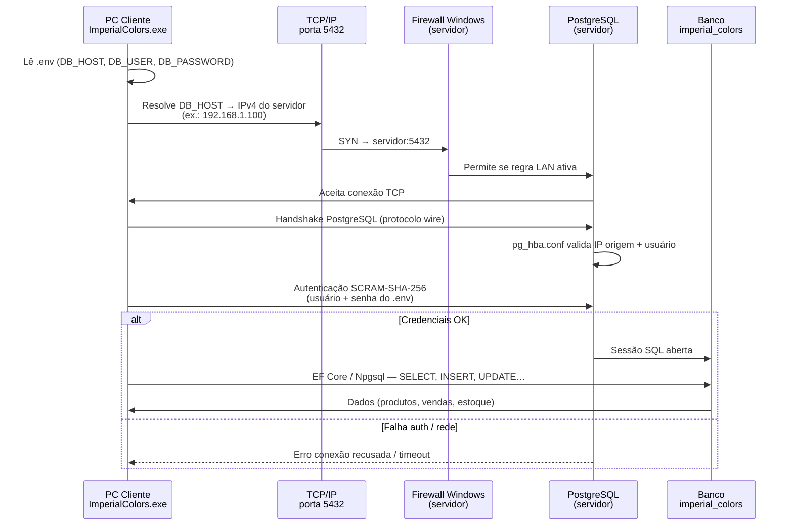

# Imperial Colors - Sistema de Gestão

Sistema de gestão desktop completo para a empresa **Imperial Colors - Tintas e Revestimentos**, desenvolvido com **.NET 10**, **WPF** e **PostgreSQL**.

---

## Tecnologias

| Componente | Tecnologia |
|---|---|
| Linguagem | C# (.NET 10) |
| Interface | WPF (Windows Presentation Foundation) |
| Banco de Dados | PostgreSQL |
| ORM | Entity Framework Core 10 |
| Arquitetura | Clean Architecture |
| PDF | iText 9 |
| Excel | ClosedXML |
| DI | Microsoft.Extensions.Hosting |

---

## Arquitetura do Projeto

```
ImperialColors/
├── src/
│   ├── ImperialColors.Domain/          # Entidades, Interfaces, Enums, Exceções
│   ├── ImperialColors.Application/     # Services, DTOs, Use Cases
│   ├── ImperialColors.Infrastructure/  # EF Core, Repositórios, Migrations
│   └── ImperialColors.UI/              # WPF, Views, ViewModels
├── scripts/                            # Scripts SQL auxiliares
├── docs/                               # Relatórios de testes
├── icons/                              # Logos e ícones
├── .env                                # Credenciais (não commitar)
├── .gitignore
├── ImperialColors.slnx
└── README.md
```

---

## Pré-requisitos

- [.NET 10 SDK](https://dotnet.microsoft.com/download/dotnet/10.0)
- [PostgreSQL 15+](https://www.postgresql.org/download/)
- Windows 10/11 (WPF é exclusivo para Windows)
- Visual Studio 2022+ ou Rider (recomendado)

---

## Instalação e Configuração

### 1. Clonar o repositório

```bash
git clone https://github.com/seu-usuario/imperial-colors.git
cd imperial-colors
```

### 2. Configurar o PostgreSQL

Abra o **pgAdmin** ou **psql** e crie o banco de dados:

```sql
CREATE DATABASE imperial_colors;
CREATE USER imperial_user WITH ENCRYPTED PASSWORD 'SuaSenha123';
GRANT ALL PRIVILEGES ON DATABASE imperial_colors TO imperial_user;
```

### 3. Configurar credenciais (.env)

Copie o arquivo `.env` na raiz do projeto e ajuste os valores:

```env
DB_HOST=localhost
DB_PORT=5432
DB_NAME=imperial_colors
DB_USER=postgres
DB_PASSWORD=SuaSenha
DB_SSL_MODE=Prefer

ADMIN_USERNAME=admin
ADMIN_PASSWORD=Admin@1234
ADMIN_EMAIL=admin@imperialcolors.local
```

> O `.env` é copiado automaticamente para a pasta de saída no build. **Nunca** commite senhas no repositório.

> A edição manual acima só é necessária na primeira instalação. Com o sistema no ar, todos esses valores podem ser alterados em **Configurações → Geral**, que grava no próprio `.env` — veja [Configurações](#configurações).

### 3.1 Dados da empresa (appsettings.json)

Os dados exibidos no cupom e cabeçalhos vêm de `src/ImperialColors.UI/appsettings.json` (copiado para a pasta de saída). Edite **sem recompilar** — reinicie o app após alterar:

```json
"DadosEmpresa": {
  "NomeFantasia": "Imperial Colors",
  "RazaoSocial": "Imperial Colors Tintas e Revestimentos LTDA",
  "Subtitulo": "Tintas e Revestimentos",
  "CNPJ": "00.000.000/0001-00",
  "Endereco": "Rua das Tintas, nº 100 - Bairro Centro, Curitiba - PR",
  "Telefone": "(41) 99999-9999"
}
```

Variáveis de ambiente (`.env`) sobrescrevem o JSON: `EMPRESA_NOME`, `EMPRESA_RAZAO_SOCIAL`, `EMPRESA_SUBTITULO`, `EMPRESA_CNPJ`, `EMPRESA_IE`, `EMPRESA_ENDERECO`, `EMPRESA_TELEFONE`, `EMPRESA_EMAIL`.

É exatamente isso que **Configurações → Geral → Dados da empresa** grava: o JSON continua sendo o valor de fábrica e o `.env` é a camada que o cliente edita pela tela.

### 4. Executar as Migrations

```bash
cd imperial-colors
dotnet ef migrations add InitialCreate --project src/ImperialColors.Infrastructure --startup-project src/ImperialColors.Infrastructure
dotnet ef database update --project src/ImperialColors.Infrastructure --startup-project src/ImperialColors.Infrastructure
```

> **Nota:** O sistema aplica as migrations automaticamente ao iniciar. Se preferir, execute manualmente com os comandos acima.

### 5. Executar a aplicação

```bash
dotnet run --project src/ImperialColors.UI
```

Ou abra `ImperialColors.slnx` no Visual Studio e pressione **F5**.

---

## Autenticação e Usuários

### Login inicial (administrador)

Na primeira execução, o sistema cria (ou garante) o usuário admin definido no `.env`:

| Campo | Valor padrão |
|---|---|
| Usuário | `admin` |
| Senha | `Admin@1234` |

### Cadastro de novos usuários

1. Na tela de login, aba **Cadastrar**
2. Após o cadastro, a conta fica com status **Aguardando aprovação**
3. Um administrador aprova em **Configurações → Gestão de Usuários**

### Valores de status no banco (`usuarios.status`)

| Valor | Significado |
|---|---|
| `1` | Aguardando aprovação (não pode entrar) |
| `2` | Aprovado (pode entrar) |
| `3` | Cancelado |

Para aprovar manualmente via SQL, use `scripts/aprovar_usuario.sql`:

```sql
UPDATE usuarios SET status = 2 WHERE username = 'seu_usuario';
```

### Recuperar senha do admin

No `.env`, defina temporariamente:

```env
ADMIN_RESET_PASSWORD=true
```

Reinicie o app. A senha do `ADMIN_USERNAME` será redefinida para `ADMIN_PASSWORD`. Remova ou comente a linha depois.

---

## Configuração em Dois ou Mais Computadores (Rede Local)

O Imperial Colors foi projetado para que **vários computadores** (balcões, PDV, escritório) acessem o **mesmo banco de dados** ao mesmo tempo. Todos enxergam produtos, estoque e vendas em tempo real.

> **Instalando no dia?** O [**Guia de Instalação — Segundo PC**](GUIA_INSTALACAO_SEGUNDO_PC.md) cobre o mesmo assunto em formato de passo a passo para seguir na hora, com o que conferir em cada etapa, como fixar o IP do servidor e o que fazer quando dá errado. A seção abaixo é a referência técnica.

### Como funciona (visão geral)

```
┌─────────────────────────────┐         ┌─────────────────────────────┐
│   PC SERVIDOR               │         │   PC CLIENTE (PDV 2, etc.)  │
│                             │         │                             │
│  PostgreSQL  ◄── banco ──►  │  rede   │  ImperialColors.exe         │
│  ImperialColors.exe         │ ◄─────► │  (sem PostgreSQL)           │
│  (opcional: PDV 1 aqui)     │  local  │                             │
└─────────────────────────────┘         └─────────────────────────────┘
         ▲                                         │
         │                                         │
         └─────────── mesmo Wi‑Fi / cabo ─────────┘
```

| Papel | O que instalar | O que configurar |
|-------|----------------|------------------|
| **PC Servidor** | PostgreSQL + Imperial Colors | Banco de dados + `.env` com `DB_HOST=localhost` |
| **Demais PCs** | Somente Imperial Colors | `.env` com `DB_HOST=<IP do servidor>` |

> **Importante:** a conexão com o banco é feita pelo arquivo **`.env`** (na pasta do `ImperialColors.exe`), **não** pelo `appsettings.json`. O `appsettings.json` serve para dados da empresa no cupom (nome, CNPJ, endereço).

---

### Passo 0 — Descobrir o IP do computador SERVIDOR

Os outros PCs precisam do **IPv4 da rede local** do servidor — **não** use `localhost` nem `127.0.0.1` neles.

#### Método 1 — PowerShell ou Prompt (recomendado)

No **PC onde o PostgreSQL ficará instalado**, abra o PowerShell e execute:

```powershell
ipconfig
```

Procure o adaptador que está **em uso**:

| Adaptador | Quando usar |
|-----------|-------------|
| **Ethernet** / **Cabo** | PC conectado por cabo de rede |
| **Wi‑Fi** / **Wireless** | PC conectado sem fio |

Anote o valor **Endereço IPv4**, por exemplo:

```
Adaptador de Rede sem Fio Wi-Fi:
   Endereço IPv4. . . . . . . . : 192.168.1.100
```

Neste exemplo, **`192.168.1.100`** é o IP que os outros computadores devem usar em `DB_HOST`.

#### Método 2 — Interface gráfica do Windows

1. **Configurações** → **Rede e Internet**
2. Clique na rede ativa (**Wi‑Fi** ou **Ethernet**)
3. Role até **Propriedades** → anote o **Endereço IPv4**

#### Método 3 — Comando direto (PowerShell)

```powershell
Get-NetIPAddress -AddressFamily IPv4 |
  Where-Object { $_.InterfaceAlias -notmatch 'Loopback' -and $_.IPAddress -notlike '169.254.*' } |
  Select-Object InterfaceAlias, IPAddress
```

Ignore endereços `169.254.x.x` (link local — indica problema de rede/DHCP).

#### Qual IP **não** usar

| Valor | Por quê |
|-------|---------|
| `127.0.0.1` / `localhost` | Só funciona **no próprio PC**; nos clientes causa erro de conexão |
| IP público do roteador | Não serve para rede interna da loja |
| IPv6 (ex.: `fe80::...`) | Use sempre o **IPv4** (ex.: `192.168.x.x`) |

> O IP local pode **mudar** se o roteador reatribuir endereços (DHCP). Para produção, configure **IP fixo** no servidor ou **reserva de DHCP** no roteador (sempre o mesmo MAC → mesmo IP).

---

### Passo 1 — Preparar o PC SERVIDOR (PostgreSQL)

#### 1.1 Instalar PostgreSQL

Instale o [PostgreSQL 15+](https://www.postgresql.org/download/windows/) neste computador e crie o banco:

```sql
CREATE DATABASE imperial_colors;
```

Anote o usuário e a senha definidos na instalação (ex.: usuário `postgres`).

#### 1.2 Permitir conexões de outros PCs na rede

Edite `postgresql.conf` (geralmente em `C:\Program Files\PostgreSQL\16\data\`):

```conf
listen_addresses = '*'
```

Edite `pg_hba.conf` (mesmo diretório). Adicione **no final** uma linha para a faixa da sua rede:

```conf
# Formato: host  BANCO  USUARIO  FAIXA_DE_IP/MASCARA  METODO

host    imperial_colors    postgres    192.168.1.0/24    scram-sha-256
```

**Como saber a faixa (`/24`)?**

| Se o IP do servidor for… | Use no `pg_hba.conf` |
|--------------------------|----------------------|
| `192.168.1.100` | `192.168.1.0/24` |
| `192.168.0.50` | `192.168.0.0/24` |
| `10.0.0.15` | `10.0.0.0/24` |

O `/24` libera todos os IPs da mesma sub-rede (ex.: `192.168.1.1` até `192.168.1.254`).

#### 1.3 Reiniciar o PostgreSQL

```powershell
# PowerShell como Administrador — ajuste o número da versão se necessário:
Restart-Service postgresql-x64-16
```

Para listar o nome exato do serviço:

```powershell
Get-Service *postgres*
```

#### 1.4 Liberar a porta 5432 no Firewall do Windows

```powershell
# PowerShell como Administrador:
New-NetFirewallRule -DisplayName "PostgreSQL Imperial Colors" `
  -Direction Inbound -Protocol TCP -LocalPort 5432 -Action Allow
```

#### 1.5 Configurar o `.env` no SERVIDOR

Na pasta do executável (`ImperialColors.exe`), edite o `.env`:

```env
DB_HOST=localhost
DB_PORT=5432
DB_NAME=imperial_colors
DB_USER=postgres
DB_PASSWORD=SuaSenhaDoPostgreSQL
DB_SSL_MODE=Prefer

ADMIN_USERNAME=admin
ADMIN_PASSWORD=SenhaSegura@2026
ADMIN_EMAIL=admin@imperialcolors.local
```

#### 1.6 Primeira execução (somente no servidor)

Execute `ImperialColors.exe` **uma vez** neste PC. O sistema:

- Cria/atualiza as tabelas (migrations automáticas)
- Cria o usuário administrador definido no `.env`

Depois disso, os demais PCs podem conectar ao mesmo banco.

---

### Passo 2 — Configurar os PCs CLIENTES (2º, 3º, 4º…)

Instale **apenas** o Imperial Colors (mesmo pacote ZIP/publicação). **Não** instale PostgreSQL nestes PCs.

#### 2.1 Editar o `.env` de cada cliente

Copie o `.env` do servidor e altere **apenas** `DB_HOST`:

```env
# Troque 192.168.1.100 pelo IPv4 REAL do servidor (Passo 0)
DB_HOST=192.168.1.100
DB_PORT=5432
DB_NAME=imperial_colors
DB_USER=postgres
DB_PASSWORD=SuaSenhaDoPostgreSQL
DB_SSL_MODE=Prefer
```

| Campo | Servidor | Clientes |
|-------|----------|----------|
| `DB_HOST` | `localhost` | **IP do servidor** (ex.: `192.168.1.100`) |
| `DB_PORT` | `5432` | `5432` (igual) |
| `DB_NAME` | `imperial_colors` | `imperial_colors` (igual) |
| `DB_USER` / `DB_PASSWORD` | credenciais do PostgreSQL | **as mesmas** do servidor |

> Cada PDV pode ter impressora diferente (configure em **Configurações → Periféricos**). O banco é compartilhado; periféricos são locais de cada máquina.

#### 2.2 Testar se o cliente alcança o servidor

No **PC cliente**, abra o PowerShell (substitua pelo IP anotado no Passo 0):

```powershell
Test-NetConnection -ComputerName 192.168.1.100 -Port 5432
```

| Resultado | Significado |
|-----------|-------------|
| `TcpTestSucceeded : True` | Rede OK — pode abrir o Imperial Colors |
| `TcpTestSucceeded : False` | Firewall, IP errado ou PostgreSQL parado — veja [Troubleshooting](#erro-em-rede-local-connection-refused) |

#### 2.3 Abrir o sistema e validar

1. Execute `ImperialColors.exe`
2. Faça login (ex.: `admin` / senha do `.env`)
3. Em **Configurações**, use **Testar Conexão** para confirmar o banco
4. Cadastre um produto no servidor e verifique se aparece no cliente (e vice-versa)

---

### Exemplo completo — Loja com 2 PDVs

| Máquina | IP local | PostgreSQL | `DB_HOST` no `.env` |
|---------|----------|------------|---------------------|
| Caixa 1 (servidor) | `192.168.1.100` | Sim | `localhost` |
| Caixa 2 | `192.168.1.101` | Não | `192.168.1.100` |

Ambos na **mesma rede** (mesmo roteador/switch). Caixa 2 aponta para o IP do Caixa 1.

---

### Exemplo — Loja com 3 ou mais computadores

| Máquina | Função | `DB_HOST` |
|---------|--------|-----------|
| PC A (`192.168.1.100`) | Servidor + PDV | `localhost` |
| PC B (`192.168.1.101`) | PDV | `192.168.1.100` |
| PC C (`192.168.1.102`) | Escritório / estoque | `192.168.1.100` |

Regra única: **todos os clientes** usam o IP do PC onde o PostgreSQL está instalado.

---

### Checklist rápido (antes de ir para produção)

- [ ] PostgreSQL instalado e rodando **apenas no servidor**
- [ ] IP IPv4 do servidor anotado (`ipconfig`)
- [ ] `listen_addresses = '*'` no `postgresql.conf`
- [ ] Regra no `pg_hba.conf` com a faixa correta (`192.168.x.0/24`)
- [ ] Firewall liberou a porta **5432** no servidor
- [ ] `Test-NetConnection` retorna `True` em **cada** PC cliente
- [ ] `.env` do servidor: `DB_HOST=localhost`
- [ ] `.env` dos clientes: `DB_HOST=<IP do servidor>`
- [ ] Imperial Colors aberto **primeiro no servidor** (migrations + admin)
- [ ] Teste de conexão OK em **Configurações** em cada máquina
- [ ] **IP fixo ou reserva DHCP** no servidor (evita quebra quando a rede reinicia)

---

### Segurança: liberar a porta TCP 5432 é vulnerável?

**Resposta curta:** abrir a porta **no firewall do PC servidor** para a **rede local da loja** é **necessário** para os PDVs funcionarem, mas **não deve** ser exposta à **internet pública**.

| Cenário | Risco | Recomendação |
|---------|-------|--------------|
| Porta 5432 aberta **só na LAN** (`192.168.x.x`) | **Baixo a moderado** — qualquer dispositivo na mesma Wi‑Fi/cabo pode *tentar* conectar | Aceitável em loja **se** PostgreSQL exige senha forte + `pg_hba.conf` restrito |
| Porta 5432 **encaminhada no roteador** (port forwarding) para a internet | **Alto** — bots varrem PostgreSQL exposto 24h | **Nunca faça isso** |
| PostgreSQL sem senha ou senha fraca | **Crítico** | Senha longa; usuário dedicado (não `postgres` genérico em produção, se possível) |
| `pg_hba.conf` com `0.0.0.0/0` | **Alto** — aceita qualquer origem | Use apenas a faixa da loja (`192.168.1.0/24`) |

**O que a regra de firewall faz**

```
Internet ──X──► Roteador ──X──► Porta 5432   (ideal: NÃO expor)
                         │
                         └──► LAN 192.168.1.0/24 ──► PC Servidor:5432  (PDVs da loja)
```

A regra `New-NetFirewallRule ... -LocalPort 5432` no **Windows do servidor** libera entrada **naquele PC**, em geral para **qualquer origem que alcance a máquina** (incluindo a LAN). Ela **não** publica o banco na internet por si só — isso só ocorre se o **roteador** fizer redirecionamento de porta.

**Camadas de proteção recomendadas (do mais importante ao complementar)**

1. **PostgreSQL escuta apenas a rede local** — `listen_addresses = '*'` escuta todas as interfaces *do PC*; combine com firewall do Windows limitando origem (regra avançada por subnet) ou garanta que o roteador **não** faça NAT da 5432.
2. **`pg_hba.conf` restrito** — permita só `192.168.1.0/24` (ou a faixa real da loja), banco `imperial_colors`, usuário específico, `scram-sha-256`.
3. **Senha forte** no `.env` (`DB_PASSWORD`) — trate como credencial de produção.
4. **Rede Wi‑Fi da loja com senha (WPA2/WPA3)** — evita que visitantes na mesma rede tentem acessar o banco.
5. **Separar rede de visitantes** (SSID convidado isolado) — ideal se o roteador suportar VLAN/convidado.
6. **Backups** — se alguém na LAN comprometer credenciais, backup recente limita o dano.

> **Conclusão:** na prática de uma loja com 2+ PDVs, abrir **5432/TCP no servidor para a LAN** é o procedimento padrão. O risco relevante aparece quando a porta fica **acessível de fora** ou quando **autenticação/rede** são fracas — não pelo fato de existir regra de firewall interna.

**Firewall mais restrito (opcional — PowerShell como Administrador)**

Libera 5432 **apenas** da sub-rede local (ajuste o IP):

```powershell
New-NetFirewallRule -DisplayName "PostgreSQL Imperial Colors (LAN)" `
  -Direction Inbound -Protocol TCP -LocalPort 5432 -Action Allow `
  -RemoteAddress 192.168.1.0/24
```

---

### Fluxograma da conexão (protocolos e camadas)



**Resumo dos protocolos**

| Camada | Tecnologia | Função |
|--------|------------|--------|
| Aplicação | Imperial Colors (WPF) + EF Core | Telas, regras de negócio |
| Driver | **Npgsql** | Traduz operações .NET → protocolo PostgreSQL |
| Sessão / auth | **PostgreSQL wire protocol** + **SCRAM-SHA-256** | Login seguro com senha |
| Transporte | **TCP** | Conexão confiável ponto a ponto |
| Rede | **IPv4** (ex.: `192.168.1.x`) | Endereçamento na LAN |
| Enlace | Ethernet ou **Wi‑Fi (802.11)** | Cabo ou sem fio até o roteador |

**Fluxo simplificado (visão operacional)**

```
[ PDV Cliente ]                    [ PC Servidor ]
ImperialColors.exe                      PostgreSQL :5432
       │                                       ▲
       │  .env → DB_HOST=192.168.1.100         │
       └──────── TCP 5432 ── LAN ──────────────┘
              (Npgsql + senha SCRAM)
```

---

### IP que muda após reinício ou queda de rede (DHCP)

**Sim, isso acontece em cabo e Wi‑Fi.** Se o roteador usa **DHCP** (padrão em quase toda rede doméstica/comercial), o IPv4 é **emprestado** por um tempo (lease). Ao reiniciar o PC, trocar de cabo/Wi‑Fi ou o roteador reiniciar, o servidor pode receber **outro IP** (ex.: era `.100`, virou `.105`). Os PDVs com `.env` fixo em `.100` **param de conectar**.

| Causa comum | Cabo | Wi‑Fi |
|-------------|------|-------|
| Reinício do PC | Pode mudar IP | Pode mudar IP |
| Reinício do roteador | Pode mudar IP | Pode mudar IP |
| Queda prolongada de energia/rede | Pode mudar IP | Pode mudar IP |
| Trocar de roteador | Quase sempre muda faixa/IP | Idem |

#### Soluções recomendadas (ordem de preferência)

**1. Reserva DHCP no roteador (melhor custo/benefício)**

No painel do roteador (geralmente `192.168.1.1` ou `192.168.0.1`):

1. Identifique o **MAC Address** da placa de rede do **PC servidor** (`ipconfig /all` → Endereço Físico).
2. Crie **Reserva DHCP / IP fixo por MAC**: sempre `192.168.1.100` → MAC do servidor.
3. Os clientes mantêm `DB_HOST=192.168.1.100` **para sempre** (enquanto o roteador não mudar).

**2. IP estático no Windows (servidor)**

Configurações → Rede → Ethernet/Wi‑Fi → Editar IP → **Manual**:

- IP: `192.168.1.100`
- Máscara: `255.255.255.0`
- Gateway: IP do roteador (ex.: `192.168.1.1`)
- DNS: gateway ou `8.8.8.8`

Use um IP **fora** do pool DHCP do roteador ou combine com reserva DHCP para evitar conflito.

**3. Nome do host em vez de IP (alternativa)**

No `.env` dos clientes, o Npgsql aceita hostname:

```env
DB_HOST=IMPERIAL-SERVIDOR
```

Para funcionar na LAN:

- **Opção A:** arquivo `C:\Windows\System32\drivers\etc\hosts` em **cada cliente**:

  ```
  192.168.1.100    IMPERIAL-SERVIDOR
  ```

- **Opção B:** nome NetBIOS do Windows do servidor (menos confiável em todas as redes).

Se o IP do servidor mudar, atualiza-se **só o `hosts` do servidor** (ou a reserva DHCP) — o `.env` dos PDVs permanece `DB_HOST=IMPERIAL-SERVIDOR`.

#### Atualizar o IP “automaticamente” a cada boot — por que **não** é a melhor ideia

| Abordagem automática | Problema |
|---------------------|----------|
| App escaneia a rede e “adivinha” o servidor | Pode apontar para o PC errado; lento; falha com firewalls |
| App reescreve `.env` sozinho | Risco de corromper config; difícil auditar; comportamento imprevisível |
| Depender do IP que “aparecer” no Wi‑Fi | Vários dispositivos PostgreSQL ou IPs temporários geram caos |

**Recomendação profissional:** estabilize o IP na **infraestrutura** (reserva DHCP ou IP estático no **servidor**), não no aplicativo. É o padrão em ERP, PDV e sistemas corporativos.

> O Imperial Colors **não** altera o `.env` automaticamente hoje — isso é intencional para previsibilidade e segurança. A correção correta é **fixar o endereço do servidor na rede**, não reconfigurar todos os PDVs quando o DHCP mudar.

#### Se o IP mudou e os PDVs pararam (procedimento de emergência)

1. No **servidor**, rode `ipconfig` e anote o **novo** IPv4.
2. Em **cada cliente**, edite `.env`: `DB_HOST=<novo_ip>`.
3. Reinicie o Imperial Colors.
4. Depois, aplique **reserva DHCP** ou **IP estático** para não repetir o problema.

---

### Dashboard
- Total de vendas do dia e do mês
- Alertas de estoque baixo e zerado
- Top 3 produtos mais vendidos
- Resumo financeiro e últimas vendas
- **Balcão e vendas externas somados:** faturamento, custo, lucro, margem, ticket médio, quantidade de vendas, o gráfico dos últimos 7 dias e os destaques de "Maiores Vendas do Mês" contam as duas origens — os mesmos números do Relatório Consolidado de Vendas. Venda externa não registra cliente nem forma de pagamento, então aparece nos destaques identificada pelo número, com o pagamento em branco
- **Visão Comissões** — quanto a loja ainda deve aos vendedores de rua, quanto já pagou, o total de comissões do mês e a lista das pendentes. O acerto em si é feito em **Vendas externas → Comissões**

### Estoque
- Cadastro completo de produtos (código interno, código de barras, categoria, marca, etc.)
- **Filtro "Apenas em Promoção"** — checkbox na listagem que exibe somente produtos com preço promocional ativo e menor que o preço de venda
- Controle de movimentações (entrada, saída, ajuste)
- Alertas de estoque baixo
- Busca por nome, código interno ou código de barras
- Suporte a leitura de código de barras (conecte o leitor USB e use no campo de busca)
- Produto não encontrado: campo limpo automaticamente com alerta sonoro e mensagem em vermelho
- **Unidades de Medida suportadas:** UN, GL (Galão), BD (Balde), LT (Litro), RL (Rolo), CX (Caixa), PCT (Pacote)
- **Galão (GL):** ao selecionar GL, o campo **Litragem** aparece automaticamente com opções **3,6L** ou **18L** — salvo na coluna `litragem_gl` do banco e exibido no estoque e PDV (ex: `Tinta Coral (GL 18L)`)
- **Balde (BD):** nova unidade para tintas vendidas em balde, disponível em todo o sistema
- **Peso (gramas):** campo opcional no cadastro do produto, número inteiro (ex.: `5500`). Ao lado do campo aparece o equivalente em quilos enquanto se digita (`= 5,5 kg`), o que evita um zero a mais passar batido. Recusa zero/negativo e valores acima de 1 tonelada por unidade. Sai como coluna no relatório de estoque

### PDV - Ponto de Venda
- Atalho no menu: **PDV - Nova venda (F2)**
- Interface rápida para vendas
- Busca de produtos por nome, código ou código de barras
- Leitor de código de barras: produto inexistente limpa o campo na hora (alerta sonoro + mensagem vermelha)
- Cálculo automático de totais
- Aplicação de descontos
- **Modal de fechamento** com formas de pagamento:
  - Dinheiro (valor recebido + troco automático)
  - Cartão Débito / Crédito (1x a 12x) / Pix / Boleto
- Atualização automática do estoque ao confirmar venda

### Histórico de Vendas
- Listagem paginada com filtro por período (coluna **Cliente** removida da grid; busca por nome de cliente ainda funciona)
- Botão **Editar Venda** — corrige uma venda já fechada (só vendas finalizadas):
  - Mexe em **forma de pagamento** (inclusive composição com várias formas, parcelas e valor recebido/troco), **quem comprou** (Consumidor Final, cliente cadastrado ou nome+CPF/CNPJ no cupom) e **observações**
  - **Itens, desconto e total não mudam aqui.** Alterá-los exigiria estornar e refazer a baixa de estoque de cada item — para isso o caminho continua sendo **Registrar Devolução** (que repõe o estoque) e uma venda nova
  - A tela abre com o pagamento que está gravado: corrige-se uma linha, não se redigita a composição inteira. Venda antiga, anterior ao pagamento composto, entra como uma linha só com o resumo do cabeçalho
  - O botão **Salvar** só libera com o saldo zerado — mesma trava do fechamento do PDV, para a venda nunca ficar com valor pago diferente do que ela vale
  - Venda **cancelada** não pode ser editada (estoque já reposto); venda **aberta** ainda vai passar pelo fechamento normal do PDV
  - Se a venda já tem NF-e/NFC-e autorizada, a tela avisa: **a nota transmitida não muda**. A correção vale para o registro interno e para o cupom; para corrigir a nota, cancele-a e emita outra
  - Toda edição fica na **auditoria** (`VENDA_EDITADA`, nível Warning) com o antes e o depois de pagamento, comprador e observações
- Botão **Registrar Devolução** cancela vendas finalizadas e repõe estoque automaticamente (transação no PostgreSQL)
- Botão **Registrar Troca** — módulo profissional de troca de produtos:
  - **Etapa 1 – Item Devolvido:** selecione o produto da venda original e a quantidade devolvida
  - **Checkbox:** "Retornar item devolvido para o estoque físico?" (para latas lacradas/não abertas)
  - **Etapa 2 – Novo Item:** busca de produto por nome, código ou código de barras
  - **Etapa 3 – Resumo Financeiro:** cálculo em tempo real da diferença
    - Troca idêntica → `Troca Idêntica`
    - Novo mais caro → `Diferença a Receber: R$ X` com seleção de forma de pagamento (Pix, Dinheiro, Débito, Crédito)
    - Novo mais barato → `Diferença a Devolver: R$ Y`
  - Toda a operação roda em uma única `IDbContextTransaction` — se qualquer etapa falhar, nada é salvo
  - Movimentações de estoque registradas automaticamente com rastreabilidade (`Troca vinculada à Venda ID X`)
- Impressão/visualização de cupom
- Botão **Emitir Nota** — fatura a venda selecionada (só vendas finalizadas):
  - Escolha entre **NF-e** (modelo 55, cliente identificado) e **NFC-e** (modelo 65, balcão)
  - A tela de emissão abre já preenchida com destinatário (cliente ou comprador do cupom), itens com a tributação atual do cadastro e as formas de pagamento da venda
  - Após salvar o rascunho, abre direto em **Ações da Nota** para transmitir à SEFAZ
  - A venda fica vinculada à nota: com NF-e/NFC-e autorizada, o botão passa a abrir as ações da nota existente (DANFE, XML, cancelamento) em vez de faturar de novo

### Vendas Externas
- Menu lateral **Vendas externas** (ícone 🚚), posicionado logo abaixo de **Vendas**
- Consolida vendas realizadas fora do estabelecimento físico
- **Fluxo A – Produto cadastrado:** busca por código de barras ou texto; preenche nome e preço base; informa quantidade e valor praticado na rua; ao concluir, dá baixa automática no estoque
- **Fluxo B – Item manual:** nome, quantidade e valor unitário livres, sem vínculo com produto — computado apenas no faturamento, sem baixa de estoque
- **Comissão por produto:** o campo fica ao lado do produto, no fluxo de adicionar o item (*seleciona produto → preenche a comissão → quantidade e valor → Adicionar*). A comissão aparece como coluna na grade de conferência, editável, antes de salvar. Vale para os dois modos, estoque e manual
  - A comissão da venda é a **soma** da dos itens: um item pode render comissão e outro da mesma venda não. O rodapé mostra o somatório e o líquido enquanto a venda é montada
  - Cada comissão não pode ser negativa nem maior que **o valor daquele item** — o limite é por item, não pelo total da venda
  - **Faturamento é o líquido:** venda de R$ 160 com R$ 30 de comissão conta **R$ 130** no Dashboard e no Relatório Consolidado. O valor cheio continua na venda, para a conferência com o vendedor. No relatório a comissão tem coluna própria — não é somada ao desconto, que é abatimento dado ao cliente
  - **Botão Comissões:** sub-janela de controle dos acertos, com filtro *A pagar / Pagas / Todas*, totais e as ações de marcar como paga ou devolver para "a pagar" (as duas ficam registradas na auditoria). Só entram vendas **com** comissão — venda sem comissão não gera pendência. Paginada em 50 por página, como as demais listagens; trocar de filtro volta para a primeira página
  - Zerar a comissão ao editar a venda também limpa a marcação de pagamento
- **Importar Lista:** o botão abre um diálogo para escolher o formato, com o tutorial e um exemplo do layout esperado logo abaixo da opção marcada; em seguida seleciona-se o arquivo. Grade de conferência editável antes da aprovação
  - **Excel (.xlsx):** primeira aba, três colunas — A = código de barras, B = nome do produto, C = quantidade
  - **CSV (.csv):** campos separados por `;` (padrão do Excel em português) ou `,`; nome com o separador dentro deve vir entre aspas
  - **Texto (.txt):** formato `CODIGO_DE_BARRAS;NOME_DO_PRODUTO;QUANTIDADE`; linhas iniciadas com `#` são ignoradas
  - Comum aos três: a linha de cabeçalho pode ficar no arquivo (se a quantidade não for um número, é ignorada); sem código de barras — ou com código não cadastrado — o item entra como manual; a quantidade aceita decimal (`1,5`)
- Botão **Aprovar e Concluir Venda** grava venda + baixas em uma única transação (`IDbContextTransaction`); falha de estoque ou validação faz rollback completo
- **Pós-venda (gerenciamento completo):**
  - **Editar:** reabre a grade de itens; altere quantidades, preços ou adicione novos itens — o estoque é recalculado automaticamente (aumento baixa diferença, redução repõe diferença; itens manuais só afetam faturamento)
  - **Excluir:** hard delete com confirmação; repõe integralmente o estoque dos produtos vinculados antes de remover a venda do PostgreSQL
  - **Registrar Troca:** modal em 3 etapas (Item Devolvido → Novo Item → Diferença Financeira), igual ao PDV, com checkbox opcional de retorno ao estoque
- Todas as operações que alteram estoque (editar, excluir, trocar) rodam em `IDbContextTransaction` com rollback automático em caso de falha
- Número da venda: `EXT-yyyyMMdd-0001`
- Tabelas PostgreSQL: `vendas_externas`, `itens_venda_externa`; movimentações de estoque vinculadas via `venda_externa_id`

### Vendas Site (integração com o e-commerce)
- Menu lateral **Vendas Site** (ícone 🌐), logo abaixo de **Vendas externas**
- Lista as vendas que o **ImperialSync** criou **neste banco** a partir de pedidos pagos no site: **Pedido Site**, **Nº Venda**, **Cliente**, **Data**, **Total**, **Pagamento**, **Parcelas**, **Status** e **Sincronizado em**. Mais recente primeiro, 50 por página, com busca por pedido do site, número da venda ou nome do comprador
- A lista nasce do registro da integração (`integration.imperial_sync_operations`), então **só aparece venda que veio do site** — venda de balcão nunca entra. Se alguém excluir uma venda depois de sincronizada, a linha continua na lista como **Venda removida** (o registro da integração não tem chave estrangeira de propósito)
- **Somente leitura:** este sistema não cria nem altera venda online. Quem cria a venda é a função `integration.apply_sale_create` do banco, chamada pelo ImperialSync, com a mesma sequência e as mesmas travas do PDV
- Estados da tela, todos **dentro da própria janela** (nenhuma caixa de diálogo): carregando, lista vazia, erro ao carregar (com **Tentar novamente**) e "integração indisponível" quando o schema `integration` não foi instalado ou o usuário do sistema não pode lê-lo
- Botão **Sincronizar com o Site** — executa `ImperialSync.exe --once` (vendas do site para a loja e, em seguida, o estoque da loja para o site):
  - Roda em segundo plano, **sem travar a tela**; o botão fica bloqueado ("Sincronizando...") e uma segunda execução não é aceita enquanto a primeira não termina (vale também se o operador sair da aba e voltar). Em outro computador da loja, o próprio ImperialSync recusa uma segunda execução ao mesmo tempo (código 13)
  - Mensagens: `Sincronizando com o site...`, `Sincronização concluída com sucesso.` e, se o programa não estiver na pasta, `ImperialSync.exe não foi encontrado na pasta do sistema.`
  - Ao terminar, a lista é recarregada sozinha. Um bloco **Detalhes da execução** mostra as últimas linhas do que o ImperialSync escreveu e o código de saída
  - **Faixa verde só quando o estoque foi de fato sincronizado:** código `0` **e** nenhum produto enviado sem cadastro no site. "O site aceitou o envio" com todos os SKUs desconhecidos **não** é sucesso: a faixa fica **amarela** com `Sincronização concluída com alerta. 222 produtos foram enviados, mas nenhum SKU foi encontrado no catálogo do site.` (ou `22 dos 222 produtos enviados não têm cadastro no catálogo do site.`), e abaixo vêm **Recebidos pelo site**, **Atualizados**, **SKUs sem cadastro**, até 10 códigos de exemplo e a orientação de cadastrá-los no site com o SKU igual ao Código do Produto. Não é erro: internet, assinatura e banco funcionaram, e a lista de vendas é recarregada normalmente
  - A cor sai de duas fontes, e basta uma apontar produto sem cadastro: o **código de saída** (`14`/`15`, do ImperialSync 1.2.0 em diante) e o **resumo do estoque** que o programa escreve (`Recebidos:`, `Atualizados:`, `SKUs desconhecidos:`, `Exemplos (...)`), lido por `ResumoEstoqueSiteLeitor`. Por isso um ImperialSync antigo (1.1.0), que ainda saía com `0`, também vira alerta. Falha de banco, de assinatura ou de internet continua **vermelha**, mesmo que o resumo exista
  - Prazo máximo de 10 minutos por execução; passado isso o processo é encerrado
- **SKU do e-commerce = campo "Código do Produto"** do cadastro de produto (`TxtCodigoInterno` → `ProdutoDto.CodigoInterno` → `Produto.CodigoInterno` → coluna `produtos.codigo_interno`). O ImperialSync envia esse valor, sem alterar, como `sku` e o site o compara por igualdade exata com `ProductVariant.sku` (exemplo: Código do Produto `DIL001` → sku `DIL001`). Não renomeie essa propriedade nem a coluna sem avisar a integração; o teste `CodigoDoProdutoComoSkuTests` acusa.
- **Este sistema não faz o trabalho do ImperialSync:** não chama a API do site, não assina nada, não conhece fila, reserva nem confirmação e não sincroniza estoque. O fluxo é `sistema → ImperialSync.exe → API do site → PostgreSQL → sistema recarrega a lista`
- Códigos de saída do ImperialSync (`ImperialSync.exe --help`) e o que a tela diz:

  | Código | Significado | Faixa |
  | ------ | ----------- | ----- |
  | `0` | Concluída, com todos os produtos enviados reconhecidos pelo site | verde |
  | `14`, `15` | Alerta: estoque enviado, mas **nenhum** produto da loja existe no catálogo do site (`14`) ou **parte** não tem cadastro (`15`) | amarela |
  | `0` com SKUs desconhecidos no resumo | ImperialSync antigo no mesmo cenário do `14`/`15` | amarela |
  | `10`, `8` | Concluída, mas há vendas que precisam de atenção / nenhum produto para enviar | amarela |
  | `3`, `13` | Outra sincronização já em andamento (neste computador / em outro) | amarela |
  | `9` | Interrompida | amarela |
  | `1`, `2`, `4`, `5`, `6`, `7`, `11`, `12` | Erro inesperado, configuração inválida, banco da loja inacessível, site recusou o acesso, site indisponível, estoque não confirmado, integração não instalada / loja incompatível, resposta do site sem assinatura válida | vermelha |
  | outro | "terminou com o código N" (nunca é tratado como sucesso) | vermelha |

- **Onde ficam os arquivos:** `ImperialSync.exe` e `ImperialSync.env` na **mesma pasta do `ImperialColors.exe`** (o sistema procura em `AppContext.BaseDirectory`). O `ImperialSync.env` tem senhas e segredos: **nunca** vai para o Git (está no `.gitignore`), nem por e-mail ou WhatsApp; restrinja o acesso no Windows com `icacls`
- **Instalação no banco da loja (uma vez, à mão, com backup):** os scripts `imperialsync-integration-schema.sql` e `imperialsync-role.sql` do repositório do site (`docs/sql/`). O usuário do banco que o **sistema** usa (o do `.env`) precisa poder ler `integration.imperial_sync_operations` — o `postgres` já pode; o `imperial_sync` (do ImperialSync) **não** é o usuário do sistema e não precisa de nada além do que o script lhe dá
- **Segurança da execução:** o processo do ImperialSync **não herda** as senhas e os segredos deste sistema (`DB_*` e variáveis com `PASSWORD`, `SECRET`, `TOKEN`... no nome); só as variáveis `STORE_DB_*`, `SYNC_*` e `INVENTORY_*`, que são dele. O texto que ele escreve passa por um filtro (sem segredos, hashes, CPF/CNPJ, e-mails nem dados de conexão) antes de aparecer na tela, e é limitado em tamanho
- Testes: `VendaSiteServiceTests`, `VendaSiteRepositoryTests`, `VendaSiteIntegrationTests` (PostgreSQL, transação revertida), `SincronizacaoSiteServiceTests` (processos de verdade, com scripts no lugar do `.exe`), `SincronizacaoSiteMensagensTests`, `SaidaProcessoSeguraHelperTests`, `RegistroDeServicosVendasSiteTests`, `VendasSiteViewModelTests`, `VendasSiteViewTests`, `UiDispatcherTests` e `SincronizacaoSiteExeRealTests` (ponta a ponta com o `ImperialSync.exe` real, só roda com `IMPERIALSYNC_E2E_EXE`, `IMPERIALSYNC_E2E_CONEXAO` e `IMPERIALSYNC_E2E_PEDIDOS`)

### Orçamentos
- Menu lateral **Orçamento** (ícone 📝), entre **PDV** e **Clientes**
- Proposta comercial **sem compromisso**: não reserva estoque, não gera venda e não movimenta financeiro
- **Cliente:** digite o nome livremente (cliente avulso) ou escolha um cadastro na lista que aparece enquanto digita — duplo clique preenche nome e telefone e vincula o cadastro; editar o nome depois desfaz o vínculo e mantém só o texto digitado
- **Itens:** dois modos, como em Vendas Externas
  - **Buscar no estoque** — traz nome, código interno, unidade e preço de venda como sugestão (o preço continua editável)
  - **Digitar manualmente** — para serviço, mão de obra ou item que não está cadastrado
- Desconto em reais, observações livres e data de validade (sugere 7 dias)
- **Situação:** `Aberto`, `Aprovado`, `Recusado` — e `Expirado`, calculado na hora a partir da validade (não é gravado)
- **Gerar PDF:** documento A4 em formato de papel timbrado — **logo + todos os dados da empresa** no topo (nome fantasia, razão social, subtítulo, CNPJ, IE, endereço, telefone e e-mail, os mesmos de Configurações), seguido de número do orçamento, cliente, itens, totais e o aviso de que não tem valor fiscal; disponível no formulário (*Salvar e Gerar PDF*) e na listagem, para reemitir quando quiser
- Listagem paginada no servidor, busca por número, cliente ou telefone
- Número do orçamento: `ORC-yyyyMMdd-0001`
- Tabelas PostgreSQL: `orcamentos`, `itens_orcamento`
- Todas as ações (criar, editar, aprovar, recusar, excluir) entram na **Auditoria de Logs** no módulo `Orçamento`

### Clientes
- Cadastro completo (nome, CPF, contatos, endereço com ViaCEP)
- Campo **E-mail** com validação em tempo real (`InputSanitizer.EmailValido`) — opcional, mas deve ser válido se preenchido
- Busca rápida e paginação
- Acesso pelo menu **Clientes** (`Views/ClientesView.xaml`)
- Vinculação opcional com vendas no PDV

### Cupom Não Fiscal
- Gerado automaticamente após cada venda
- Exibe forma de pagamento, parcelas e troco (quando aplicável)
- Impressão direta na impressora configurada em Periféricos
- Opções: imprimir, visualizar, salvar PDF

### Mercadorias / Fornecedores
- Acesse pelo menu **Mercadorias**
- **Aba Fornecedores:** cadastro de fornecedores (CNPJ, CEP, contatos)
- **Aba Listas de Compra:** monte listas de produtos para comprar, marque itens comprados e finalize a lista
  - **Anexar Nota da Compra:** selecione PDF ou imagem (PNG/JPG) via assistente do Windows; o arquivo é convertido em `byte[]` e salvo na coluna `BYTEA` (`nota_fiscal_conteudo`) do PostgreSQL — centralizado e protegido no banco
  - **Visualizar Nota:** extrai os bytes do banco e abre no visualizador padrão do Windows (habilitado somente quando há anexo)
  - Coluna **Nota NF** na grid indica se a lista possui nota anexada

### Relatórios
- Vendas por período (PDF e Excel)
- **Relatório Consolidado de Vendas (Geral)** — unifica vendas de balcão (PDV) e vendas externas com coluna **Origem** (`Balcão` / `Externa`); exportação PDF e Excel
- **Relatório de Vendas Externas** — auditoria item a item das vendas de rua (filtro por período)
- **Vendas por Canal e Produto** — cada produto vendido no período com o canal por onde a venda entrou; exportação PDF e Excel
  - Canais: **Loja física** (PDV), **Venda externa (Rua)** e **Site** (pedido trazido pelo ImperialSync)
  - O canal é **deduzido, nunca digitado**: sai de onde a venda foi registrada, não de um campo que alguém preenche
  - ⚠️ A venda do site é gravada na **mesma tabela** das vendas de balcão — quem as separa é o registro da integração (`integration.imperial_sync_operations`), e é esse cruzamento que impede o pedido do site de ser somado como balcão. Loja sem o ImperialSync instalado simplesmente não tem linhas de "Site"
  - Colunas: data da venda, canal, código do produto, produto, número da venda, quantidade, valor unitário e valor total
  - Item manual de venda externa (sem produto cadastrado) sai marcado como `(sem cadastro)` em vez de com a célula vazia
  - **Totais por canal** no rodapé do PDF e em aba própria no Excel; canal sem venda no período aparece **zerado**, não sumido
  - No Excel, data e valores vão como número (não texto) e a planilha abre com autofiltro — dá para filtrar por canal e somar direto
- **Movimentação de Produtos (Entrada/Saída)** — extrato de estoque por produto e data: quando o item entrou e em que dias saiu; exportação PDF e Excel
  - Colunas: data, código do produto, produto, unidade, tipo (Entrada/Saída/Ajuste), quantidade, saldo anterior, saldo posterior e origem
  - **Origem** resolve a linha sozinha: o número da venda e o canal quando a saída veio de uma venda (`20260918-0001 — Site`), senão o motivo (`Estoque inicial`, `Inventário`)
  - O Excel tem a coluna **Qtd com Sinal** (saída negativa): somada, dá o saldo movimentado no período sem separar entradas de saídas à mão
  - Ordenado por código do produto e depois por data — a história de cada item se lê em sequência
- **Cópia arquivada automática** (só nestes dois relatórios de controle) — além do arquivo que você escolhe onde salvar, o sistema guarda uma cópia em `C:\relatorios_sistema\{mes-ano}\{dd-MM-yyyy}\` (`RELATORIOS_PATH` no `.env`), mesma estrutura do backup. Gerar o mesmo relatório duas vezes no mesmo dia substitui a cópia. Se o arquivamento falhar (pasta sem permissão, disco cheio), o relatório pedido **continua salvo** e a tela avisa que só a cópia não foi guardada
- **Análise de Giro e Desempenho de Produtos** — três visões com exportação PDF/Excel:
  - **Mais Vendidos** — ranking por volume (balcão + vendas externas)
  - **Menos Vendidos** — itens com saída no período, ordenados do menor para o maior
  - **Nunca Vendidos (Encalhados)** — produtos com estoque e zero vendas no intervalo
- Estoque completo (PDF e Excel) — inclui a coluna **Peso**: no PDF em formato de leitura (`5,5 kg`, `800 g`, `-` quando não cadastrado) e no Excel como número em quilos, para somar o peso da carga e filtrar por faixa
- Produtos com estoque baixo
- Produtos sem estoque

### Backup Automático Híbrido
- Disparo silencioso na abertura da `MainWindow` (após login), em `Task.Run` — **não bloqueia** login, menu ou PDV
- Verifica `DataUltimoBackup` na tabela PostgreSQL `parametros_sistema` (chave `DataUltimoBackup`)
- Executa backup se nunca rodou ou se passaram **≥ 7 dias** (`BACKUP_INTERVALO_DIAS` no `.env`)
- Destino padrão: `C:\backup_sistema\{mes-ano}\{dd-MM-yyyy}\` (ex.: `C:\backup_sistema\junho-2026\20-06-2026\`)
- Conteúdo do backup diário:
  - `backup_imperial_dd_MM_yyyy.dump` — banco completo no formato custom do `pg_dump` (`-F c`): comprimido e restaurável tabela por tabela
  - `backup_imperial_dd_MM_yyyy.sql` — o mesmo banco em script SQL de texto, legível no Bloco de Notas
  - `appsettings.json` — configurações locais
  - `logos_empresa\` — pasta de ícones/logos da interface e cupons
- **Os dois arquivos do banco são o mesmo instante:** o `pg_dump` lê o banco uma vez só e gera o `.dump`; o `.sql` é convertido a partir dele pelo `pg_restore`, sem nova leitura. Essa conversão também prova que o `.dump` está legível no dia em que foi gerado. O `pg_restore` usado é o da mesma pasta do `pg_dump`
- Para restaurar:

  ```powershell
  # Banco inteiro, a partir do .dump
  pg_restore -h localhost -U postgres -d imperial_colors --no-owner --no-acl backup_imperial_dd_MM_yyyy.dump

  # Banco inteiro, a partir do .sql
  psql -h localhost -U postgres -d imperial_colors -v ON_ERROR_STOP=1 -f backup_imperial_dd_MM_yyyy.sql

  # Só uma tabela (ex.: produtos apagados por engano), num banco à parte, sem mexer no de produção
  createdb -h localhost -U postgres imperial_recuperacao
  pg_restore -h localhost -U postgres -d imperial_recuperacao -t produtos backup_imperial_dd_MM_yyyy.dump
  ```

  O banco de destino precisa existir e estar **vazio** (`createdb`) — restaurar por cima do banco em uso duplica ou conflita com os dados atuais
- Em caso de falha: log silencioso em `C:\backup_sistema\backup_erros.log`; tenta novamente na próxima abertura
- Variáveis `.env`: `BACKUP_PATH`, `BACKUP_INTERVALO_DIAS`, `BACKUP_PREFIXO_EMPRESA`, `PG_DUMP_PATH` (opcional)

### Atualização do Sistema
- Botão **⭳ Atualizar Sistema** em **Configurações → Sobre o Sistema**: consulta a última Release publicada no GitHub, compara com a versão do próprio executável, baixa o `ImperialColors-win-x64.zip` anexado e troca os arquivos
- A versão instalada vem do assembly, gravada pelo workflow de release a partir da tag `vX.Y.Z` — não existe número de versão escrito à mão no código
- **Qual repositório fornece as releases é configurável:** variável `ATUALIZACAO_REPO` no `.env`, no formato `dono/repositorio`. Em branco, usa `P-FCode/imperial-colors`
  - O repositório precisa ser **público**: o atualizador consulta a API do GitHub sem token, e num repositório privado a resposta é `404`
  - Trocar o valor vale na próxima abertura do sistema, **sem depender de publicar release** — é o que permite mudar o projeto de conta sem deixar máquinas já instaladas apontando para o lugar antigo
  - O repositório em uso é registrado no log a cada verificação, indicando se veio do `.env` ou do padrão

### Configurações
- **Empresa e preferências gerais são editáveis na tela** — não é mais preciso abrir o `.env` por fora
  - **Dados da empresa:** nome fantasia, razão social, subtítulo, CNPJ (com máscara e validação de dígitos), Inscrição Estadual, endereço, telefone e e-mail. Salvar aplica na hora: título da janela, cabeçalho do menu, cupons e relatórios passam a usar os novos dados sem reiniciar
  - **Preferências gerais:** mensagem de rodapé do cupom e pasta de backup
  - **Conexão com o banco:** continua **somente leitura**, exibida com a senha mascarada e com o botão **Testar Conexão**. Trocar servidor/porta/base é tarefa de instalação, feita direto no `.env`: um erro ali deixa o sistema sem abrir, e aí não há tela para corrigir
  - A gravação no `.env` é atômica (arquivo temporário + troca) e preserva comentários e ordem das linhas
  - Toda alteração entra na **Auditoria de Logs** no módulo `Configurações`
- **Navegação por cards** para submódulos (Geral, Periféricos, Gestão de Usuários, **Auditoria de Logs**)
- **Auditoria de Logs:** listagem paginada no servidor com filtros por período, nível, módulo e busca textual; detalhes em modal
- **Periféricos:** seleção de impressora para cupom + teste de leitor de código de barras
- **Gestão de usuários (Admin):** aprovar, cancelar e **excluir permanentemente** operadores (hard delete no PostgreSQL), com proteção contra autoexclusão e remoção do último administrador aprovado
- Informações do sistema

---

## Interface (WPF)

O sistema utiliza tema centralizado em `Resources/AppTheme.xaml`:

- **Janela principal:** abre maximizada (`WindowState="Maximized"`) após o login
- **Menu lateral:** indicador amarelo (3px) + fundo destacado na aba ativa
- **Inputs:** altura mínima 36px, texto centralizado verticalmente
- **Botões:** hover suave (amarelo escuro / borda amarela nos secundários), cursor `Hand`
- **Scrollbars:** estilo fino com `PART_*` corretos — arraste e roda do mouse funcionam em login/cadastro
- **Configurações:** cards clicáveis com ícone, título e descrição

### Persistência e performance (EF Core)

- **`IDbContextFactory<AppDbContext>`** — padrão correto para WPF assíncrono: cada operação de repositório cria um contexto curto e isolado, evitando `Cannot access a disposed context instance`
- Repositórios e serviços registrados como **Singleton**; ViewModels permanecem Transient por escopo de página (apenas estado de UI)
- Erros de banco exibem a mensagem detalhada do PostgreSQL (`DbUpdateException` + inner exception)
- Busca de produtos com debounce (300 ms) e cancelamento de buscas anteriores
- Paginação (50 itens/página), `AsNoTracking` e Global Query Filter (`ativo = true`) nas consultas
- **Exclusão permanente (hard delete):** Produtos, Clientes, Fornecedores e **Usuários** são removidos fisicamente do PostgreSQL quando permitido (usuários: bloqueio de autoexclusão e do último admin aprovado)
- Detalhes em `docs/RELATORIO_HOMOLOGACAO_DBCONTEXT.md`, `docs/RELATORIO_ESTOQUE_PERFORMANCE.md` e `docs/RELATORIO_ERRO_SALVAMENTO_PRODUTO.md`

### Formatação visual (pt-BR)

- Cultura `pt-BR` configurada globalmente em `App.xaml.cs`
- `FormattingHelper` + conversores em `App.xaml`: moeda (`R$`), data (`dd/MM/yyyy`), data/hora, quantidade+unidade
- Cadastro de produto: valores monetários exibidos como `R$ 45,50` na edição

### Performance e paginação

- Listagens (Estoque, Clientes, Mercadorias, Vendas, Vendas Externas, Comissões): **50 registros/página** com `Skip/Take` no PostgreSQL e `AsNoTracking`, com "Página X de Y" e os botões Anterior/Próxima
- DataGrids com virtualização de linhas (`VirtualizingStackPanel.Recycling`)
- Logos em cache (`BitmapCacheOption.OnLoad`) — não recarregados a cada navegação
- PDV: desconto em **R$** ou **%** com cálculo automático do total líquido

---

## Guia de Testes

### Cadastro de produtos
1. Acesse **Estoque** no menu lateral
2. Clique em **+ Novo Produto**
3. O código interno é gerado automaticamente (ou clique em "Gerar")
4. **Categoria** e **Marca** são obrigatórias — use os botões **+** ao lado dos ComboBoxes para cadastro rápido
5. Selecione a **Unidade** (UN, GL, BD, LT, RL, CX, PCT):
   - Se **GL (Galão)** for selecionado, aparece automaticamente o campo **Litragem do Galão** com opções **3,6L** e **18L** — campo obrigatório para GL
6. Preço de custo e venda devem ser maiores que zero; estoque inicial não pode ser negativo
7. Para usar código de barras: conecte o leitor USB e posicione o cursor no campo "Código de Barras"
8. Preencha os demais campos e clique em **Salvar Produto**
9. A listagem carrega **50 produtos por página** — use **◀ Anterior / Próxima ▶** para navegar

> **Exclusão:** Produtos, Clientes e Fornecedores usam **hard delete** (`DELETE` no banco). A exclusão é bloqueada apenas quando há vendas, listas ou outros vínculos comerciais registrados. Movimentações de estoque isoladas não impedem a exclusão de produtos.

### Registrar Troca de Produto
1. Acesse **Histórico de Vendas** no menu lateral
2. Selecione uma venda com status **Finalizada**
3. Clique em **🔄 Registrar Troca**
4. **Etapa 1:** selecione o produto devolvido e a quantidade; marque o checkbox se o item voltará ao estoque físico
5. **Etapa 2:** busque o novo produto (nome, código ou barras) e informe a quantidade
6. **Etapa 3:** o sistema calcula automaticamente a diferença; se houver valor a receber, selecione a forma de pagamento
7. Clique em **✔ Confirmar Troca** — a operação é atômica (transação completa no PostgreSQL)

### Cadastro de clientes
1. Acesse **Clientes** no menu
2. Clique em **+ Novo Cliente**
3. Preencha os dados e salve

### Realizando uma venda (PDV)
1. Clique em **PDV - Nova venda (F2)** no menu lateral (ou pressione **F2**)
2. Digite o nome, código ou código de barras do produto no campo de busca
3. Selecione o produto da lista ou pressione Enter
4. Ajuste a quantidade clicando nos botões +/- ou editando diretamente
5. Aplique desconto se necessário
6. Clique em **✓ FINALIZAR VENDA**
7. O cupom será exibido automaticamente

### Corrigir uma venda já fechada
1. Acesse **Vendas** no menu
2. Selecione uma venda com status **Finalizada**
3. Clique em **✏ Editar Venda**
4. Ajuste o que estiver errado:
   - **Como foi pago:** remova a linha errada (✕) e adicione as formas corretas até o **Saldo restante** chegar a zero
   - **Quem comprou:** Consumidor Final, cliente cadastrado (busca por nome/CPF/CNPJ) ou dados no cupom
   - **Observações**
5. Clique em **Salvar correção** — o botão só libera com o saldo zerado
> Para corrigir **item, quantidade, preço ou desconto**, esta tela não serve: registre a devolução (que repõe o estoque) e faça a venda de novo.

### Registrar devolução de venda
1. Acesse **Vendas** no menu
2. Selecione uma venda com status **Finalizada**
3. Clique em **Registrar Devolução**
4. Confirme — o estoque dos itens vendidos será reposto automaticamente
5. Verifique no **Dashboard/Estoque** se as quantidades aumentaram

### Impressão de cupom
- Após a venda: o cupom é exibido automaticamente
- No histórico: acesse **Vendas**, selecione uma venda e clique em **Cupom**

### Relatórios
1. Acesse **Relatórios** no menu
2. Selecione o relatório na lista lateral (agrupado por categoria: Vendas, Estoque, Preços, Análise)
3. Ajuste **Data Início** e **Data Fim** quando o relatório exigir período (dia final inclusivo)
4. Escolha **PDF** ou **Excel** e clique em **Gerar relatório**
5. Escolha onde salvar o arquivo

> **Nota:** o ranking de giro considera apenas itens vinculados a um produto cadastrado (`ProdutoId`). Itens manuais de venda externa entram no relatório de Vendas Externas, mas não no ranking por produto.

### Fornecedores
1. Acesse **Mercadorias** no menu
2. Clique em **+ Novo Fornecedor** e preencha os dados

### Gerando um orçamento
1. Acesse **Orçamento** no menu e clique em **+ Novo Orçamento**
2. Digite o nome do cliente — se ele já for cadastrado, aparece uma lista; duplo clique preenche nome e telefone
3. Confira a **Validade** (vem preenchida com 7 dias)
4. Adicione itens em **Buscar no estoque** (Enter ou duplo clique no resultado) ou em **Digitar manualmente**, para serviço/mão de obra
5. Informe **Desconto** e **Observações** se precisar — o total no rodapé atualiza sozinho
6. Clique em **Salvar e Gerar PDF**, escolha onde salvar e o arquivo abre em seguida
7. Confirme em **Estoque** que a quantidade dos produtos usados **não mudou** — orçamento não baixa estoque
8. Na listagem, use **Aprovar** / **Recusar** para registrar a resposta do cliente, e **Gerar PDF** para reemitir o documento quando quiser

### Editando dados da empresa pela tela
1. Acesse **Configurações → Geral**
2. Altere os campos de **Dados da empresa** e clique em **Salvar** — o nome no menu e no título da janela muda na hora
3. Faça uma venda e gere o cupom: os dados novos já aparecem, sem reiniciar
4. Gere um orçamento em PDF: o cabeçalho traz a logo e os mesmos dados atualizados
5. Em **Banco de Dados (.env)** a string de conexão aparece apenas para conferência (senha mascarada); use **Testar Conexão** para validar e **Abrir .env** se precisar mudar o servidor
6. Confira em **Configurações → Auditoria de Logs** que as alterações foram registradas no módulo `Configurações`

---

## Comandos Úteis

```bash
# Compilar a solução completa
dotnet build

# Executar a aplicação
dotnet run --project src/ImperialColors.UI

# Criar nova migration
dotnet ef migrations add NomeDaMigration --project src/ImperialColors.Infrastructure --startup-project src/ImperialColors.Infrastructure

# Aplicar migrations no banco
dotnet ef database update --project src/ImperialColors.Infrastructure --startup-project src/ImperialColors.Infrastructure

# Reverter migration
dotnet ef migrations remove --project src/ImperialColors.Infrastructure --startup-project src/ImperialColors.Infrastructure
```

---

## Estrutura do Banco de Dados

| Tabela | Descrição |
|---|---|
| `produtos` | Cadastro de produtos (coluna `litragem_gl` para Galão 3,6L/18L) |
| `categorias` | Categorias de produtos |
| `marcas` | Marcas de produtos |
| `movimentacoes_estoque` | Histórico de movimentações |
| `clientes` | Cadastro de clientes |
| `vendas` | Registro de vendas (forma de pagamento, parcelas, troco, status) |
| `itens_venda` | Itens de cada venda |
| `fornecedores` | Cadastro de fornecedores |
| `listas_compra` | Listas de compras |
| `itens_lista_compra` | Itens de cada lista (produto de estoque ou item manual) |
| `trocas` | Registro de trocas de produtos (vinculado à venda de origem, controle transacional) |
| `orcamentos` | Orçamentos ao cliente (número, validade, situação, totais) — não movimenta estoque |
| `itens_orcamento` | Itens de cada orçamento (produto do estoque ou item manual) |
| `usuarios` | Usuários do sistema (login e permissões) |

---

## Troubleshooting

### Não consigo entrar / "aguardando aprovação"

1. Use o usuário **`admin`** com senha **`Admin@1234`** (conforme `.env`)
2. O campo de login aceita **usuário ou e-mail**
3. Se alterou o banco manualmente, confirme `status = 2` (número, não texto)
4. Alterar só o status **não muda a senha** — use a senha definida no cadastro
5. Recompile e execute: `dotnet run --project src/ImperialColors.UI`

### App fecha sozinho após clicar em Entrar (sem mensagem)

Esse comportamento foi corrigido. A causa era o `ShutdownMode` do WPF encerrando o app quando a tela de login fechava, **antes** de abrir a janela principal. Recompile com a versão mais recente:

```bash
dotnet build
dotnet run --project src/ImperialColors.UI
```

Credenciais padrão: `admin` / `Admin@1234`

### Executar testes de autenticação

```bash
dotnet test tests/ImperialColors.Application.Tests
```

### Erro: "Não foi possível conectar ao banco"
1. Verifique se o PostgreSQL está rodando (no **servidor**, se estiver em rede)
2. Confirme as credenciais no `.env` (`DB_HOST`, `DB_USER`, `DB_PASSWORD`)
3. Em rede local: no cliente, `DB_HOST` deve ser o **IPv4 do servidor**, não `localhost`
4. Use a função **Testar Conexão** em **Configurações**

### Erro de migrations ao iniciar
```bash
dotnet ef database update --project src/ImperialColors.Infrastructure --startup-project src/ImperialColors.Infrastructure
```

### Erro em rede local: "Connection refused"

1. Confirme o **IP correto** do servidor com `ipconfig` (Passo 0 da seção [Configuração em Dois ou Mais Computadores](#configuração-em-dois-ou-mais-computadores-rede-local))
2. No PC cliente, o `.env` deve ter `DB_HOST=192.168.x.x` (IP do servidor) — **não** `localhost`
3. Verifique se `listen_addresses = '*'` está no `postgresql.conf` e se há regra correspondente no `pg_hba.conf`
4. Confirme que o serviço PostgreSQL está rodando no servidor: `Get-Service *postgres*`
5. Verifique a regra de firewall na porta **5432** no servidor
6. Teste do cliente: `Test-NetConnection -ComputerName <IP_DO_SERVIDOR> -Port 5432`

---

## Novidades — Versão 1.3.0

### Integração Cosmos Bluesoft (Código de Barras EAN-13)
- Ao sair do campo **Código de Barras** no cadastro de produtos, se o código tiver 13 dígitos e o produto não existir localmente, o sistema consulta automaticamente a [API Cosmos Bluesoft](https://cosmos.bluesoft.com.br/).
- O **nome do produto** é preenchido automaticamente se encontrado.
- Se a API retornar uma imagem (`thumbnail`), ela é exibida em um painel amarelo discreto logo abaixo do campo de código.
- Token configurado via variável de ambiente `COSMOS_TOKEN` no `.env`.

### Créditos do desenvolvedor
- O rodapé da tela de **Configurações** exibe: `Desenvolvido por: cappellifelipe@gmail.com` de forma discreta e elegante.

### Geração de PDF — Manual de Uso
- Botão **"📄 Manual de Uso (PDF)"** disponível em Configurações → seção Documentos.
- Gera o *Manual de Operação do Usuário — Imperial Colors* com 4 seções: Dashboard e BI, Estoque, PDV e Vendas Externas.

### Geração de PDF — Contrato de Prestação de Serviços
- Botão **"📑 Contrato de Serviços (PDF)"** disponível em Configurações → seção Documentos.
- Gera o *Contrato Oficial de Prestação de Serviços de Desenvolvimento* com qualificação das partes, objeto detalhado, cláusula fiscal (módulo NF-e/NFC-e como escopo futuro opcional) e linhas de assinatura.
- Numeração de páginas aplicada automaticamente via segunda passagem no PDF.

---

## Novidades — Versão 1.5.0

### Configurações da empresa e do `.env` editáveis pela tela
- **Antes:** os dados da empresa e as preferências gerais só existiam no `.env`; para corrigir um CNPJ era preciso abrir o arquivo por fora e reiniciar o sistema.
- **Agora:** o painel **Geral** de Configurações grava direto no `.env`, com validação antes da escrita:
  - `ArquivoEnvService` grava de forma atômica (arquivo temporário + troca) preservando comentários e ordem das linhas.
  - `AppConfigService` ganhou `Recarregar()` e o evento `ConfiguracoesAlteradas`; a `MainWindow` assina esse evento e atualiza título, nome da empresa e logo na hora.
  - `RelatorioService` passou a ler a empresa pelo `IAppConfigService` (antes era `IOptionsMonitor`), então o próximo cupom/relatório já sai com o cadastro novo, sem reiniciar.
  - `EmpresaConfig` ganhou o campo `Email` e o override por variável de ambiente passou a distinguir "variável ausente" de "variável definida como vazia".
- **Fora do escopo por decisão de projeto:** a **conexão com o banco** segue somente leitura na tela. Ela define se o sistema abre ou não — um valor errado gravado pela UI deixaria o cliente sem tela para corrigir. Continua no `.env`, com **Testar Conexão** e **Abrir .env** disponíveis em Configurações.

### Módulo Orçamento
- Nova entrada **Orçamento** na barra lateral, com listagem paginada, formulário e geração de PDF.
- Itens podem vir do estoque (com código, unidade e preço sugeridos) ou ser digitados manualmente (serviço, mão de obra, item não cadastrado).
- Cliente pode ser avulso (nome digitado) ou vinculado a um cadastro existente.
- Situações `Aberto` / `Aprovado` / `Recusado`, com `Expirado` derivado da data de validade.
- **Nada de estoque ou financeiro é tocado** — orçamento é proposta, não venda. Há teste de integração garantindo que nenhuma movimentação de estoque é criada e que aprovar um orçamento não gera venda.
- **PDF em formato de papel timbrado:** o topo traz a logo e o bloco completo da empresa, sem título de relatório. O número do orçamento saiu do cabeçalho e passou para o bloco de dados, junto com emissão, cliente, telefone, validade, situação e atendente. Se o arquivo da logo não existir, o PDF continua saindo — só que centralizado e sem imagem.
- Migration `AddOrcamentos` (tabelas `orcamentos` e `itens_orcamento`), aplicada automaticamente na abertura do sistema.

### Script de atualização do código do produto (Paraná Colors)
- `tools/gerar_update_ref_parana.py` lê a planilha de cadastro e gera um script `UPDATE` para preencher `produtos.codigo_interno` com a **REF PARANÁ** nos produtos já importados.
- O casamento é feito por marca + nome + unidade + tamanho da embalagem, e o script é idempotente (rodar duas vezes não muda nada além da primeira).
- **REFs repetidas na planilha** recebem um sufixo sequencial, porque o código do produto é único no banco. A REF `501010172` vinha em dois produtos e virou `5010101721` (TINTA EMBORRACHADA MARROM BURGUES CORAL) e `5010101722` (TINTA EMBORRACHADA PEDRA ALTA). O apêndice no fim do `.sql` registra a troca e já traz o comando pronto caso o fornecedor confirme outra REF.
- Tudo roda dentro de uma transação, só toca produtos ativos da marca `Parana colors` e nunca sobrescreve um código em uso por outro produto — o que não puder ser aplicado sai no relatório final, sem quebrar nada.
- Passo a passo para executar no cliente (backup, `psql`, leitura do relatório e solução de erros): [`tools/GUIA_ATUALIZAR_CODIGO_PRODUTO.md`](tools/GUIA_ATUALIZAR_CODIGO_PRODUTO.md).

---

## Novidades — Versão 1.4.0

### Modo de Contingência Offline (PDV)
- Health-check periódico do PostgreSQL (`DatabaseHealthService`, ~8s) com evento `IsOnline` para a UI.
- Badge no PDV: **🟢 Online** / **🟠 Offline (Contingência)**.
- SQLite local em `%LocalAppData%\ImperialColors\pdv_contingency.db` (`ContingencyDbContext`) com vendas, itens, pagamentos e cache de estoque.
- Se o servidor cair na finalização (`F2`), a venda é gravada offline com `ContingenciaId` (idempotência) e baixa no estoque local.
- `DataSyncService` sincroniza pendências ao reconectar (e a cada ~15s online), aplica estoque/movimentações no PostgreSQL e evita duplicidade via índice único em `vendas.contingencia_id`.

### Auditoria de Logs (Configurações)
- Nova tabela PostgreSQL `logs_auditoria` (migration `AddLogsAuditoriaAndContingenciaId`).
- Card **Auditoria de Logs** em Configurações com filtros (período, nível, módulo, texto), paginação server-side (50/página) e DataGrid virtualizado.
- Duplo clique / **Ver detalhes** abre modal com payload JSON/stack.
- Eventos de PDV (venda online, offline e sync) passam a registrar auditoria automaticamente.

---

## Novidades — Versão 1.3.1

### Correção de alinhamento nas barras de busca/filtro
- **Bug:** nos campos de busca dos módulos (Estoque, Clientes, Mercadorias, Vendas), o texto digitado aparecia mais recuado da borda esquerda do que o texto de exemplo (placeholder) exibido quando o campo estava vazio — a lupa e o placeholder usavam uma margem diferente do `Padding` real do campo.
- **Correção:** o template do estilo `TextBoxFiltro` (`Resources/AppTheme.xaml`) posiciona o placeholder com o **mesmo `Padding`** do campo (`TemplateBinding Padding`). O ícone de lupa foi removido das barras de filtro; o padding esquerdo voltou ao padrão (`10,5,10,5`) para o texto iniciar junto à borda esquerda.
- Criada a propriedade attached `Helpers/PlaceholderHelper.cs` (`PlaceholderHelper.Text`), que permite definir o texto de apoio direto no XAML de cada tela, sem duplicar lógica de visibilidade:
  - **Estoque:** "Buscar por nome, código ou código de barras..."
  - **Clientes:** "Buscar por nome, telefone ou e-mail..."
  - **Mercadorias → Fornecedores:** "Buscar por nome, telefone ou e-mail..."
  - **Mercadorias → Listas de Compra:** "Buscar por nome ou fornecedor..."
  - **Vendas:** "Buscar por número da venda..."
- Como a correção foi feita no template compartilhado, qualquer novo campo que use o estilo `TextBoxFiltro` já nasce alinhado corretamente, sem repetir código.

### Largura padronizada nos campos de busca/filtro
- **Bug:** nas telas em que o campo de busca é o único elemento do card (Clientes, Fornecedores, Listas de Compra), o `TextBox` esticava (`HorizontalAlignment="Stretch"`, padrão do WPF) até a borda direita do card, ocupando 100% da largura disponível.
- **Correção:** o estilo `TextBoxFiltro` define `HorizontalAlignment="Left"` e largura fixa `Width`/`MaxWidth` de **560px**, alinhado à esquerda em todas as barras de filtro dos módulos.

---

## Licença

Desenvolvido para uso exclusivo da **Imperial Colors - Tintas e Revestimentos**.

> Desenvolvido por: cappellifelipe@gmail.com
